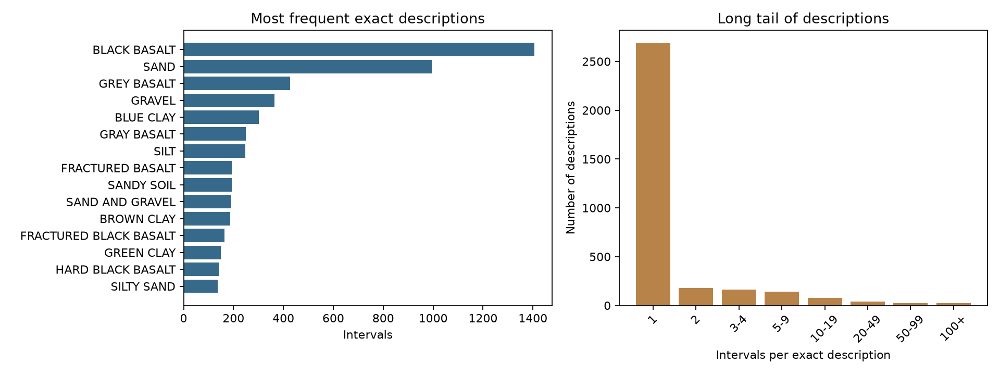
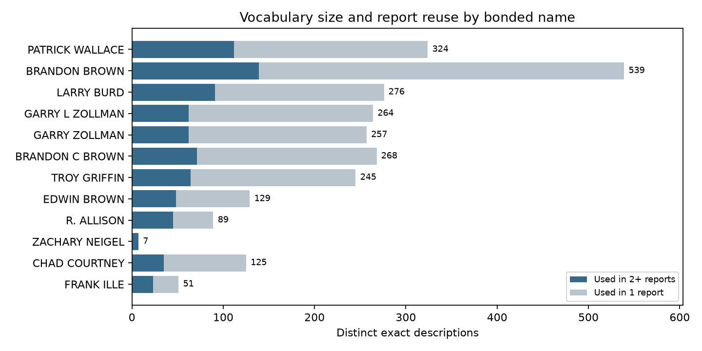
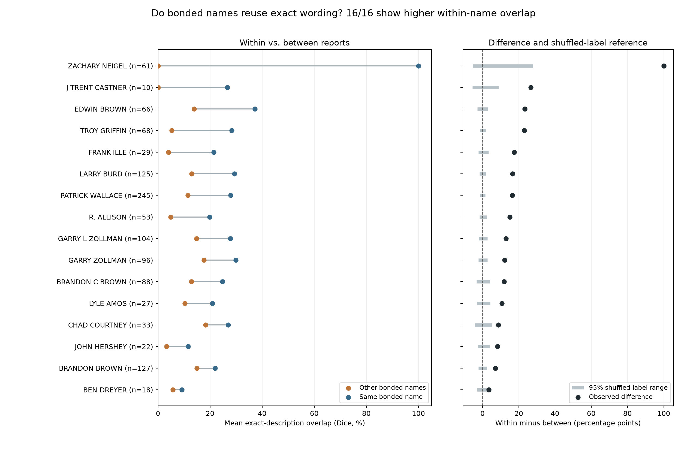
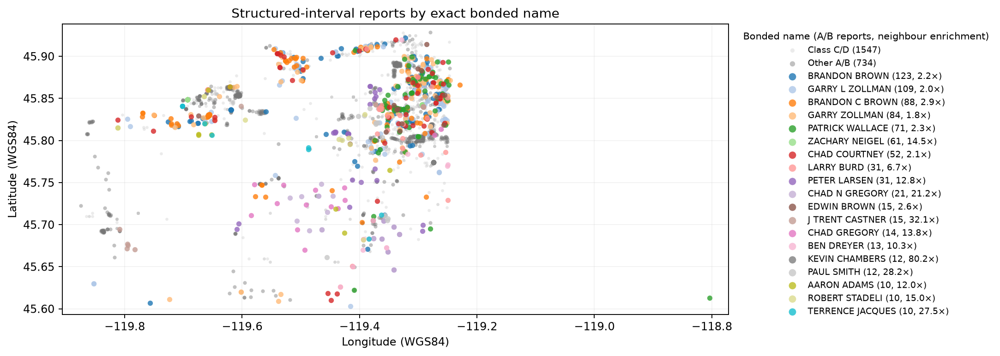
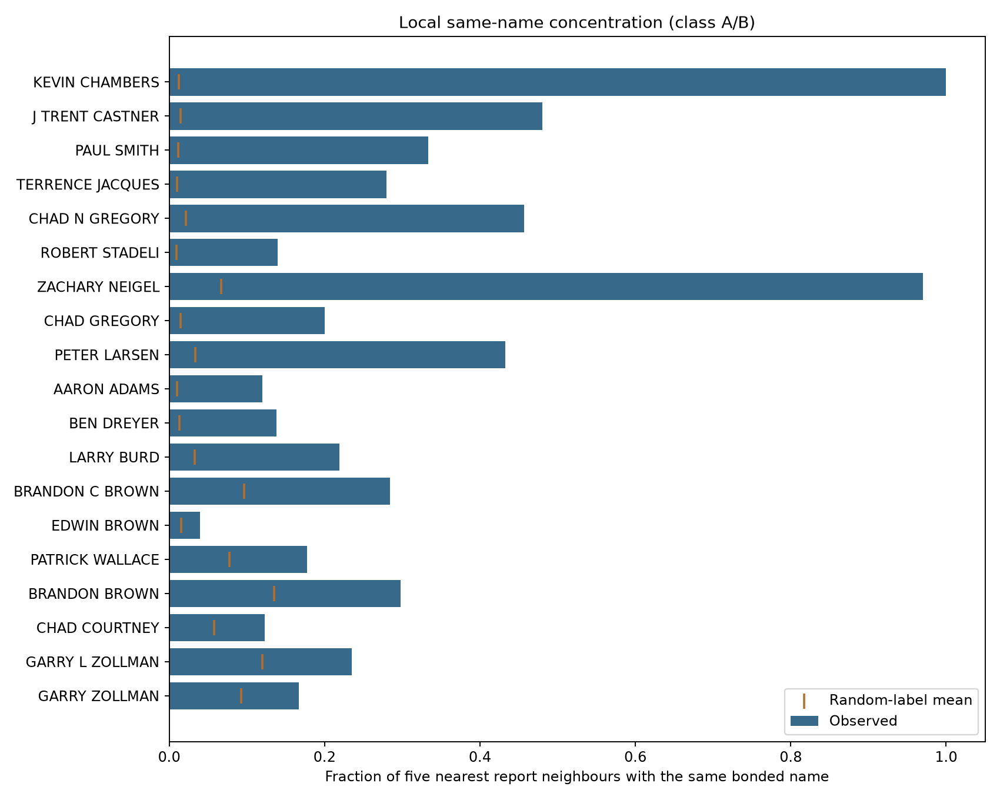

# Raw lithology and report identity profile

Generated from the local OWRD download on 2026-09-28 with `uv run python scripts/profile_raw_lithology.py`, `uv run python scripts/investigate_bonded_naming_spatial.py`, and `uv run python scripts/compare_bonded_descriptions.py`. Re-run all three after source download changes. The JSON summaries record main counts. Generated CSVs are ignored by Git; figures embedded below are retained with this report.

## Sources and scope

The configured study area is 19 township/range keys in `00_config/owrd_download.yml`. `01_raw/owrd/wells_raw.csv` is the OWRD FeatureServer report table: **7,402 report records**, each with a unique `wl_id` and `well_folder`. `01_raw/wells/<well_folder>/metadata.json` stores the corresponding report metadata. `01_raw/wells/<well_folder>/lithology.csv` stores downloaded structured intervals; `03_processed/lithology/lithology_all_raw.csv` concatenates its nonempty rows. The analysis uses that combined table, joined on **both** `well_id = wl_id` and `well_log = well_folder`. A folder/report is the counting unit for “well” below; multiple reports can describe the same physical borehole.

| Report type | All reports | Reports with structured intervals | Interval rows |
|---|---:|---:|---:|
| Water Well | 4,908 | 1,661 | 12,383 |
| Geotechnical Hole | 1,625 | 1,220 | 2,620 |
| Monitoring Well | 869 | 186 | 583 |
| **Total** | **7,402** | **3,067** | **15,586** |

All **7,402** metadata JSON files and **7,402** per-report lithology CSVs are present. The per-report files contain **15,586** rows in total; their rows match the combined table exactly as a multiset. All **15,586** interval rows match one well record and the expected folder. **4,335** report records have no structured intervals; this is absence from the structured table, not proof of no lithology in a PDF. The append-only `01_raw/owrd/download_log.csv` records download attempts and was not used as a unique-report source. `02_gis/wells_all.csv` is a derived location copy. No category field exists in the source interval schema or the inspected processed interval/well tables.

The downloader parses OWRD HTML, trims `material_raw`, drops blank descriptions and rows without numeric bounds, and calculates `thickness_ft = to_ft - from_ft` before writing its structured CSV. Thus the 0 missing descriptions, 0 invalid bounds, and 0 thickness mismatches below describe **retained structured rows**, not every line in OWRD reports. The reported thickness is not an independent source measurement. The exact vocabulary here is exact as stored in `material_raw`, not necessarily character-for-character from the upstream HTML or PDF.

## Interval QC

Among **15,586 matched interval rows / 3,067 reports**: there are **0** identical full-row duplicates, **2 rows in 1 report** sharing an interval number, **13 zero-thickness rows in 10 reports**, and **0 negative-thickness rows**. There are **83 overlap flags in 47 reports** and **33 gap flags in 25 reports**. These flags can coincide on a row. An overlap/gap compares each interval's `from_ft` with the maximum earlier `to_ft` in the same report after sorting by depth; tolerance is 0.01 ft. It does not assert that the sequences represent a single continuous stratigraphic column. The generated `interval_qc.csv` identifies affected rows. Nothing was corrected.

## Description vocabulary

Among the **15,586 retained interval rows / 3,067 reports**, there are **3,336 distinct exact `material_raw` strings**. A profiling key that trims outer whitespace, collapses repeated whitespace, and uppercases text also has **3,336** distinct values. Therefore `collapsed_variants.csv` is empty for this download. This result partly reflects the downloader's existing trim step and the mostly uppercase OWRD text; it does not imply that spelling, punctuation, abbreviation, or geological synonyms are standardized. No synonym was merged. The existing category field requested for within-category counts does not exist, so none was created.

**2,306 of 3,336 phrases (69.1%)** occur once; another **653** occur 2–4 times. The most frequent exact descriptions are `BLACK BASALT` (**1,406 intervals, 712 reports, 73,810 ft summed thickness**), `SAND` (**994, 947, 28,749.9 ft**), and `GREY BASALT` (**427, 184, 22,615 ft**). Summed thickness is an interval-length total, not a geological volume, and includes QC-flagged intervals. `raw_descriptions.csv` and `comparison_keys.csv` give interval counts, distinct reports, and thickness for every phrase/key. The examples are source wording, not labels assigned by this project.

*Figure 1. Exact `material_raw` descriptions across 15,586 structured intervals: 15 most frequent phrases (left) and the long tail by interval count per phrase (right).*

## People and organizations

The FeatureServer metadata supplies `owner_name`, `bonded_full_name`, `bonded_name_company`, and `bonded_license_nbr`. These are separate roles/attributes. **No interpreter, log-author, or explicit driller field exists in these structured sources.** A bonded name may be associated with a log but does not establish who wrote each interval phrase. Owner patterns are especially vulnerable to project/location assignment. `identity_values.csv` gives every exact nonblank value with its counts, and `identity_summary.csv` gives missingness.

| Field | Distinct usable values | Blank / 7,402 reports | Unknown placeholder / 7,402 | Reports with intervals and usable value / 3,067 | Associated intervals / 15,586 |
|---|---:|---:|---:|---:|---:|
| `owner_name` | 3,051 | 3,260 | 0 | 1,498 | 10,656 |
| `bonded_full_name` | 206 | 1,686 | 111 | 1,850 | 12,972 |
| `bonded_name_company` | 145 | 3,530 | 0 | 1,787 | 12,422 |
| `bonded_license_nbr` | 145 | 1,583 | 0 | 1,888 | 13,037 |

“Usable” excludes blank strings and explicit unknown tokens, including `UNKNOWN UNKNOWN` and `UNKNOWN OWRD STAFF`. Each report has at most one value per field in this table. A report with 10 intervals contributes 1 to that value's report count and 10 to its interval count. The same interval can be associated with an owner, bonded name, company, and license simultaneously; **do not sum across role totals**. Values are not merged across spelling variants. `suspected_aliases.csv` contains **64 review candidates**: 23 groups with identical letters/digits after punctuation and spaces are removed, and 41 groups sharing a bonded license. For example, `GARRY L ZOLLMAN` and `GARRY ZOLLMAN` share license `1881.0` in the downloaded CSV. This is evidence for review, not a confirmed merge; some license groups contain different names. No automatic aliasing affects the counts.

## Naming patterns and limits of comparison

`naming_profiles.csv` includes every exact owner, bonded name, or bonded company value associated with **at least 10 reports containing intervals**: 7 owner values, 27 bonded names, and 21 companies. `identity_phrase_frequencies.csv` lists every phrase's interval and distinct-report frequencies for those values. “Vocabulary size” counts distinct exact phrases. “Top phrase interval share” is the largest phrase count divided by all intervals associated with the value. “Simpson concentration” sums squared phrase shares, so larger numbers mean more concentration in common phrases. “Phrases used in 2+ reports” measures repeat usage, and “unique to value” means absent from **all other nonblank values in the same field**. These measures depend strongly on sample size, the distribution of logged geology/depth, report type, and unmerged name variants; none alone establishes personal consistency.

| Bonded name (exact) | Reports | Intervals | Phrases | Phrases in one interval | Top phrase share | Phrases not used by another bonded name |
|---|---:|---:|---:|---:|---:|---:|
| PATRICK WALLACE | 278 | 1,969 | 324 | 208 | 15.3% | 246 |
| BRANDON BROWN | 189 | 1,984 | 539 | 389 | 10.8% | 412 |
| LARRY BURD | 158 | 1,205 | 276 | 172 | 23.2% | 174 |

For example, `LARRY BURD` has `BLACK BASALT` in **279 intervals / 128 reports** and `SAND` in **106 / 99**. `PATRICK WALLACE` has `GREY BASALT` in **301 / 101** and `GRAY BASALT` in **196 / 103**. This spelling contrast is useful for manual review, but the exact name values themselves have possible aliases and the wells need not encounter the same materials.

*Figure 2. Distinct exact descriptions for the 12 bonded names with the most interval reports, split by whether a phrase appears in one report or at least two. The segments sum to total vocabulary size, shown at each bar's end. Names are kept as recorded; vocabulary size is not adjusted for report count or geology.*

For example, `BRANDON BROWN` has **539 distinct exact descriptions**: **139** occur in at least two of that name's reports, while **400** occur in only one report. The table above uses a different “once” count: **389** of those 400 occur in only one *interval*; the remaining **11** occur in multiple intervals within a single report. Thus Figure 2's total vocabulary size and the reuse table's 139 are different, compatible counts.

The full [BRANDON BROWN description example](BRANDON_BROWN.md) lists every exact string with its report and interval counts. It illustrates how detailed compound descriptions, abbreviations, and spelling variants increase the number of strings without implying hundreds of different rock types.

### Within-name versus between-name wording

`bonded_reuse_summary.csv` covers all **27 exact `bonded_full_name` values with at least 10 reports containing intervals**. A phrase is “reused” if it occurs in **at least two distinct reports** associated with that same name. `bonded_reused_descriptions.csv` gives every exact phrase with both report and interval counts. These are complete raw descriptions, not individual word tokens or geological classes.

| Exact bonded name | Reports | Distinct exact phrases | Phrases reused in 2+ reports | Most widespread phrase | Reports using that phrase |
|---|---:|---:|---:|---|---:|
| PATRICK WALLACE | 278 | 324 | 112 | `SANDY SOIL` | 151 (54%) |
| BRANDON BROWN | 189 | 539 | 139 | `BLACK BASALT` | 104 (55%) |
| LARRY BURD | 158 | 276 | 91 | `BLACK BASALT` | 128 (81%) |
| GARRY L ZOLLMAN | 134 | 264 | 62 | `BLACK BASALT` | 99 (74%) |
| ZACHARY NEIGEL | 61 | 7 | 7 | `BLACK COARSE SAND` | 58 (95%) |

For `LARRY BURD`, `BLACK BASALT` appears in **128 of 158 reports** and **279 intervals**, whereas `SAND` appears in **99 reports** and **106 intervals**. These report counts can overlap because one report can contain both phrases. For `PATRICK WALLACE`, `GRAY BASALT` appears in **103 reports** and `GREY BASALT` in **101**; the overlap between those report sets is not inferred by adding the counts. `ZACHARY NEIGEL` has a very small exact vocabulary in 61 reports, but 58 of that name's 61 class A/B mapped reports share one coordinate and completion year 2022. Its apparent reuse may reflect a single project or reporting template. Generic phrases such as `SANDY SOIL` and construction statements such as `ABANDON 2" MW BY OVERDRILL ...` also occur, so these measures do not by themselves establish consistent *rock-type* naming.

**Method.** For each report, let $A$ be its set of distinct exact `material_raw` descriptions. For two different reports, their Sørensen–Dice similarity is

$$
D(A,B)=\frac{2|A\cap B|}{|A|+|B|}.
$$

Thus 0 means no identical descriptions and 1 means identical description sets; repeated intervals with the same wording count once per report. Compare reports only within the same report type, township/range, completion decade, and completed-depth bin (0–100, 100–300, 300–600, or 600+ ft). A matched group needs at least **three reports per name** and at least **two names**. For each report $r$, average $D$ separately against the other same-name reports and the other-name reports in its group. For name $d$, average those report-level scores over its $n_d$ matched reports:

$$
W_d=\frac{1}{n_d}\sum_{r\in d}\overline{D}_{\mathrm{same}}(r),\qquad
B_d=\frac{1}{n_d}\sum_{r\in d}\overline{D}_{\mathrm{other}}(r),\qquad
\Delta_d=W_d-B_d.
$$

There are **35 matched groups / 1,192 reports**. The plot includes the **16 names with at least 10 matched reports**; other eligible names in those groups still contribute to the between-name comparison. It shows $W_d$, $B_d$, and their difference. As a reference, **999 shuffles of whole-report name labels within each matched group** preserve group membership and each name's report count. The gray range covers the middle 95% of shuffled $\Delta_d$ values; it is **not** a confidence interval. A positive difference beyond that range means exact wording is more similar within that name than expected from these matched reports if names were exchangeable.

*Figure 3. Left: average exact-description Dice similarity to same-name reports (blue) and other-name reports (orange), with matched report count beside each name. Right: the within-minus-between difference (black dot) and middle 95% of within-group shuffled-name results (gray line). Names are sorted by observed difference.*

All **16** eligible names have positive differences; **15** exceed their shuffled 95% range (one-sided permutation *p* ≤ 0.005; Benjamini–Hochberg adjusted *q* ≤ 0.005). `BEN DREYER` is positive by **3.5 percentage points**, but does not exceed the shuffled range (*p* = 0.052). For `BRANDON BROWN`, within-name Dice is **22.0%** versus **14.9%** against other names, a **7.0-point** difference. `ZACHARY NEIGEL` has **100%** within-name and **0%** other-name overlap in matched groups; **58 of its 61 reports share one coordinate and the same three-description set**, so that extreme result may reflect one project or template. These are associations with exact bonded-name values, **not** proof of who authored the text or evidence of distinct rock types. Matching on broad report attributes does not guarantee that the wells encountered the same geology. Full per-name results and permutation values are in `bonded_within_between_similarity.csv`; suspected aliases remain separate.

### Spatial concentration of bonded names

`03_processed/wells/well_with_lithology.csv` has coordinates and unique `wl_id` values for **3,063 of 3,067 interval reports**; four interval reports are absent. Its coordinates exactly match `latitude_dec`/`longitude_dec` in the OWRD metadata, whose downloader requests WGS84 coordinates. Of the mapped reports, **1,516** have class A/B locations, **153** class C, and **1,394** class D. The location classes reflect the repository's source/error rules; class D is often PLSS-derived and unsuitable for a precise clustering measure. The map shows C/D as faint context and colours A/B points for the **19 exact bonded names with at least 10 A/B reports**. Other A/B points are grey. Map limits use the mapped latitude/longitude extent. Distances for the statistic use WGS84 / UTM zone 11N (EPSG:32611), in metres.

*Figure 4. Mapped structured-interval reports. The legend gives each exact bonded name's class A/B report count and nearest-neighbour enrichment ratio. C/D locations and other A/B reports are grey. Coincident reports overplot.*

For each report in the **899 named A/B reports** (60 exact names), the analysis finds its **five nearest other reports** in that same pool. For each name, the observed quantity is the fraction of those five-neighbour positions occupied by the same name, averaged across that name's reports. A reference is formed by **999 seeded shuffles of names among the fixed 899 locations**, preserving how many reports each name has. The **enrichment ratio** is observed fraction divided by the mean shuffled fraction. It is a unitless measure of how often nearby reports share the same name relative to this dataset's name frequencies; it is not a geological correlation coefficient or the probability that a cluster is real. `bonded_spatial_summary.csv` gives all 19 observed fractions, shuffled reference means and 95% simulation ranges, ratios, one-sided permutation *p* values, and Benjamini–Hochberg adjusted *q* values.

| Exact bonded name | A/B reports | Same-name fraction observed | Shuffled mean | Enrichment | After shuffling within report type and decade | After excluding all repeated coordinate pairs |
|---|---:|---:|---:|---:|---:|---:|
| BRANDON BROWN | 123 | 29.8% | 13.5% | 2.2× | 1.7× | 1.9× (122 reports) |
| GARRY L ZOLLMAN | 109 | 23.5% | 12.0% | 2.0× | 1.3× | 1.7× (105 reports) |
| PATRICK WALLACE | 71 | 17.7% | 7.8% | 2.3× | 1.2× | 1.9× (63 reports) |
| ZACHARY NEIGEL | 61 | 97.0% | 6.7% | 14.5× | 8.0× | Insufficient: 3 reports |
| LARRY BURD | 31 | 21.9% | 3.3% | 6.7× | 2.7× | 6.4× (28 reports) |
| EDWIN BROWN | 15 | 4.0% | 1.5% | 2.6× | 0.8× | 2.8× (13 reports) |

*Figure 5. Each bar is the observed share of five nearest A/B report neighbours with the same bonded name; orange ticks show the mean under 999 whole-area name shuffles. The figure includes all 19 eligible exact names.*

The whole-area shuffles test whether names are spatially concentrated relative to **the observed distribution of named A/B wells**, rather than relative to uniformly scattered points. A second shuffle holds each report's type and completion decade fixed, addressing some assignment differences; it does not equalize geology or location. The large change for `PATRICK WALLACE` (2.3× to 1.2×) shows why a whole-area score should not be read as personal preference. The 899-report pool contains **134 reports at repeated exact coordinate pairs**; a sensitivity analysis excludes every report at a repeated pair, leaving **765**. It retains at least 10 unique-coordinate reports for some names, including `LARRY BURD`, but only three for `ZACHARY NEIGEL`. Its 14.5× whole-area score is therefore driven by a location stack and cannot establish a broad spatial cluster. Different reports at one coordinate may represent separate wells; exclusion is a sensitivity check, not a correction to the source. Where several reports are equidistant, the five neighbours are chosen reproducibly in report-ID order.

The naming and spatial results together identify which exact wording differences warrant local manual review. They do not establish that wells described by different names intercepted the same materials. No stratigraphic correlations or formation tops are inferred, and Burns picks were not used. Company patterns remain separate from bonded-person patterns; no alias or geological synonym was merged.
