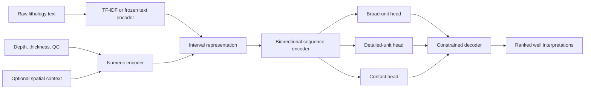

# Model architecture

**Date:** 2026-10-05  
**Status:** Gradient-boosted trees selected for the first predictive model

## Prediction task

Given an ordered lithology log, predict:

1. Broad stratigraphic unit for every interval or atomic depth segment.
2. Detailed unit when the training data support it.
3. Probability and identity of a stratigraphic top or bottom at each candidate boundary.
4. Several valid whole-well interpretations.
5. Confidence, data-quality flags, and an abstention decision.

## Features

### Lithology text

- Preserve `material_raw` unchanged.
- Derive character 3–5 gram and word 1–2 gram TF-IDF features.
- Parse common material, color, texture, hardness, weathering, and construction terms.
- Keep modifiers because they may distinguish flow tops, interbeds, and sediments.
- Record missing or ambiguous text explicitly.

### Depth and interval geometry

- From depth, to depth, midpoint, and thickness.
- Depth relative to completed depth.
- Position within the logged sequence.
- Interval count, gaps, overlaps, and zero-thickness flags.
- Distance to the top and bottom of the available log.

### Sequence context

- Preceding and following descriptions.
- Neighboring interval thicknesses.
- Running summaries above and below an interval.
- Locations of major text transitions such as sediment to basalt.

### Spatial context

After location QC, candidate spatial features include EPSG:26911 coordinates, distance to interpreted training sites, and nearby accepted contacts. Elevation features require confirmation of the vertical datum.

Every experiment must compare:

1. Lithology and depth only.
2. Spatial context only.
3. Combined features.

This prevents a spatially memorized model from being mistaken for a lithology interpreter.

### Excluded prediction features

- `picked_by`.
- Target labels or features derived from them.
- Raw well or site IDs.
- Report URLs.
- Human acceptance from the same model version.
- GemPy surfaces built using the evaluation site's true stratigraphy.

## Selected first model: gradient-boosted trees

The first predictive model will use gradient-boosted decision trees. This choice fits the current sample size and the mixture of text-derived, numeric, categorical, spatial, and QC features. A single decision tree remains an interpretation baseline. Neural networks, interval Transformers, and language models remain later comparisons after more independent paired wells are available.

Gradient-boosted trees require fixed-length rows. Convert each variable-length well sequence into two related training tables:

1. **Segment table:** one row per atomic lithology segment, with fixed windows and running summaries of the intervals above and below it.
2. **Boundary table:** one row per candidate depth boundary, with the descriptions, thicknesses, and predicted units immediately above and below it.

The outputs are:

- Hierarchical unit probabilities for each segment, including `.general` labels.
- Contact probability for each candidate boundary.
- Probability that the boundary is the bottom of the shallower unit.
- Probability that the boundary is the top of the deeper unit.
- An abstention or review-required status.

A versioned sequence decoder combines these row-level predictions into a complete ordered well interpretation. It may choose a parent `.general` label when the detailed child is unsupported.

## Comparison baselines

Before training a sequence network, implement:

1. Majority broad unit by normalized-depth band.
2. Spatial-depth prior without lithology text.
3. Regularized multinomial logistic regression using text and numeric features.
4. Gradient-boosted trees using parsed text, depth, QC, sequence context, and optional spatial features; this is the selected first model.

The serious model must outperform these on held-out GWIS groups, resolved physical-borehole groups when available, and spatial blocks.

## Later sequence-model comparison

Development order:

1. Gradient-boosted segment and boundary models.
2. Dynamic-programming decoder over their probabilities.
3. Frozen pretrained text embeddings if grouped validation supports them.
4. Small bidirectional GRU or Transformer over intervals after training-data expansion.
5. Compare a CRF output layer with the explicit decoder.

The dataset is too small to justify training a large text model from scratch.

## Multi-task outputs

The model has three prediction heads:

- Broad-unit probabilities.
- Detailed-unit probabilities conditioned on supported broad units.
- Top and bottom contact probabilities at each candidate boundary.

Unknown targets are masked from the corresponding loss. Class balancing or focal loss may be tested, but only against unweighted baselines and macro class metrics.

## Constrained decoding

Hard constraints:

- Positive interval thickness.
- Monotonically increasing depths.
- Non-overlapping output intervals.
- Labels from the approved ontology.

Soft constraints:

- Expected regional stratigraphic order.
- Transition penalties.
- Minimum plausible unit thickness.
- Penalty for unlikely repeated formations.

Soft rules must be versioned and overridable. Faults, erosion, missing units, and incomplete penetration can violate a simple regional stack. The decoder should flag low-scoring sequences rather than force every well into one pattern.

Beam search or dynamic programming will return the top `K` valid sequences. Those alternatives become inputs to human preference review.
